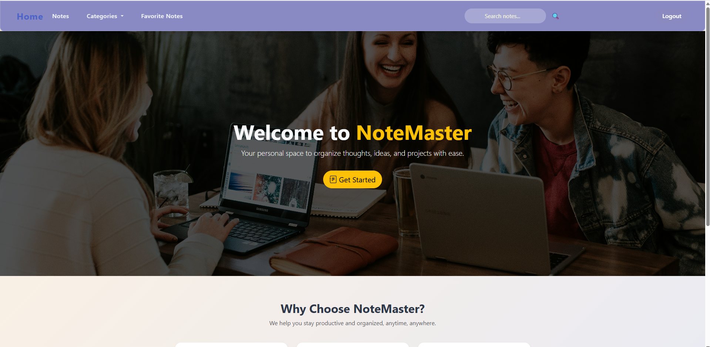
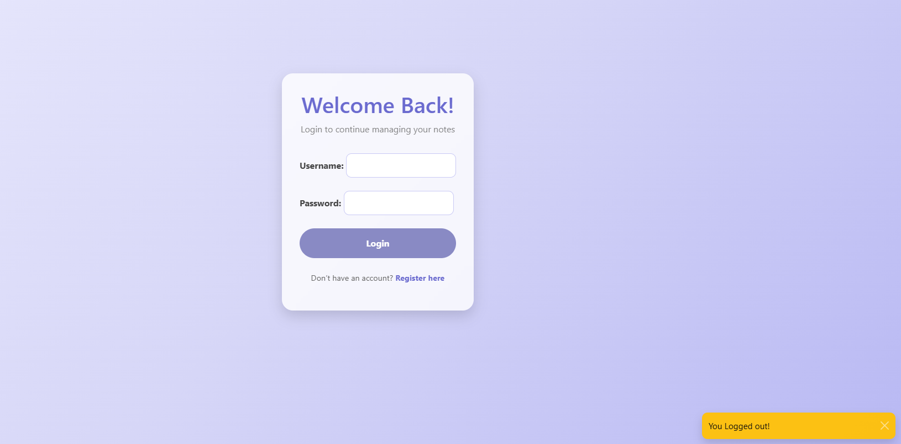
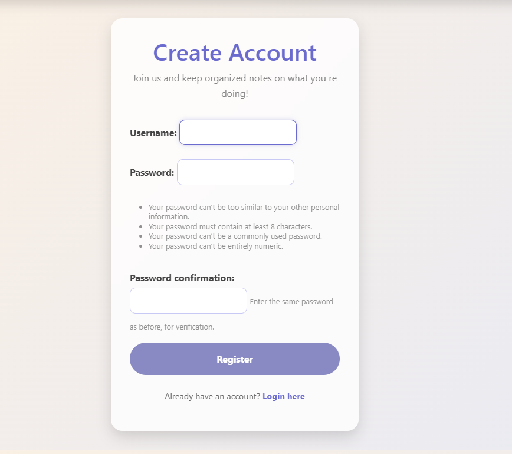
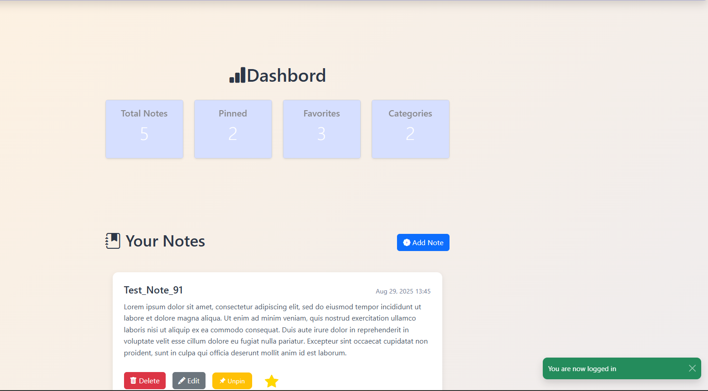

# NoteMaster



**NoteMaster** is a modern, user-friendly web application built with **Django** and **Bootstrap**, designed to help users manage and organize their notes efficiently. With a secure authentication system, personalized note management, and advanced organizational features, it is perfect for personal productivity or as a showcase of full-stack development skills.

---

##  Features

### User Authentication
- Secure login and registration system
- Only logged-in users can access, create, and manage their notes
- Each user has private notes — no data mixing between users

### Note Management
- Create, edit, and delete notes easily
- Organize notes by **categories** for better structure
- **Pin important notes** to keep them on top
- **Add notes to favorites** for quick access

### Responsive Design
- Built with **Bootstrap** and custom CSS, ensuring a mobile-friendly and clean interface

### Real-time User Feedback
- Notifications and messages using **Bootstrap toast components**

---

## 🛠 Technologies Used
- **Backend:** Django (Python)
- **Frontend:** HTML, CSS, Bootstrap
- **Database:** SQLite (default with Django)
- **Authentication:** Django's built-in authentication system
- **Other:** CSRF protection, Django forms, template inheritance

---

## 💡 User Experience Highlights
- Clean and modern UI with Bootstrap
- Notes can be quickly categorized, pinned, or marked as favorite
- Personalized dashboards for each user
- Smooth notifications for actions like login, note creation, and updates

---

## 📸 Screenshots

### Login Page
  
*Secure login for registered users.*

### Registration Page
  
*Easy registration form for new users.*

### Dashboard
  
*Personalized dashboard showing pinned and favorite notes.*

---

## 🚀 Installation & Setup

```bash
1 git clone https://github.com/yourusername/NotesApp.git
  cd NotesApp
2 python -m venv .venv
  source venv/bin/activate  #On Windows use `.venv\Scripts\activate`
3 pip install -r requirements.txt
4 python manage.py migrate
5 python manage.py createsuperuser #Optional if you want admin access
6 python manage.py runserver
7 #Open your browser and navigate to http://127.0.0.1:8000/
